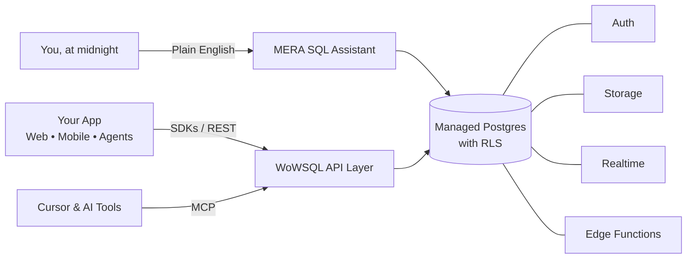

<!-- ============================================================= -->
<!-- Saravana Pradeep P · Founder, WoWSQL Technologies             -->
<!-- Built from Thoothukudi, Tamil Nadu, India                     -->
<!-- ============================================================= -->

<div align="center">


<a href="https://wowsql.com">
  
</a>

<br/>

<a href="https://wowsql.com"></a>
<a href="https://versionly.dev"></a>
<a href="https://wowsms.in"></a>

<br/>

<a href="https://www.linkedin.com/in/saravanapradeep/"></a>
<a href="https://www.linkedin.com/company/wowsql/"></a>
<a href="https://mcp.wowsql.com"></a>

<br/>


</div>


## 👋 Vanakkam! I'm Saravana


I'm the founder & CEO of **WoWSQL Technologies Private Limited**, and I build software the slightly unreasonable way.

Most people have an idea and build a product. I have an idea, build the backend, then the API, then the SDKs, then the CLI, then an MCP server, then a dashboard to monitor all of it… and then I look up and realise the "weekend side project" has quietly become a cloud platform. 🙃

I'm obsessed with developer infrastructure, Postgres, cloud systems, AI tooling and automation, and with turning the painful engineering chores everyone tolerates into products nobody has to tolerate anymore.

> **Polite self-roast:** I have a suspicious number of repositories, a heroic number of browser tabs, and a deeply optimistic relationship with the phrase *"this should only take an hour."*

<br clear="right"/>


<div align="center">


<a href="https://wowsql.com">
  
</a>


</div>

WoWSQL is the thing I'd wanted to exist for years: a proper managed Postgres platform with a full backend around it, built in India, priced and designed for developers who'd rather ship features than babysit infrastructure.

Every project is a real, portable Postgres database. Around it you get everything a modern app expects from day one, so you can skip the sprint of wiring up login screens and file buckets before writing any actual product.

### 🧩 What's inside the box

| | Feature | Why it matters |
|---|---|---|
| 🐘 | **Managed Postgres** | A genuine Postgres database per project, with Row Level Security and no lock-in. Your data stays yours, in a format the whole world already understands. |
| 🔐 | **Authentication** | Sign-ups, logins, OAuth providers and MFA toggled from the dashboard, wired straight into RLS so permissions live next to the data. |
| 📦 | **Storage** | File storage that sits alongside your database, so avatars, invoices and uploads don't need yet another vendor. |
| ⚡ | **Realtime** | Subscribe to table changes and stream events to your UI as data moves. Live dashboards without a message-queue side quest. |
| 🔌 | **Instant APIs** | REST APIs generated from your schema, plus typed SDKs, so the boilerplate writes itself. |
| 🛰️ | **Edge Functions** | Custom server logic without deploying, patching or scaling servers yourself. |
| 🤖 | **MERA SQL Assistant** | Ask questions in plain English, get SQL and answers back. Great for juniors, founders, and seniors who've forgotten JOIN syntax again. |
| 🧠 | **MCP Server** | Connect your database to AI tools like Cursor through [mcp.wowsql.com](https://mcp.wowsql.com) so your coding agent understands your real schema. |
| 🧰 | **SDKs + CLI** | TypeScript and Python SDKs, a CLI and a VS Code extension, because developers live in terminals and editors. |
| 🆓 | **Free tier** | Start building without a credit card. Upgrade to dedicated Postgres when your side project gets ambitious. |
| 🌏 | **India + US posture** | Infrastructure in India and the US: local data residency for Indian teams, a fast familiar home for global ones. |

### 🛠️ Feels like this

```ts
import { createClient } from '@wowsql/sdk'

const wow = createClient(WOWSQL_URL, WOWSQL_KEY)

// Query like you mean it. Types, auth and realtime included.
const { data } = await wow
  .from('users')
  .select('*')
```

### 🗺️ How the pieces fit



### 🎯 Why I built it

- Because "just use a hyperscaler" usually means a maze of consoles, an orchestra of services and a PhD in IAM before you can store a lonely user record.
- Because Indian developers deserve world-class developer infrastructure that's built here, supported by people who answer quickly, and doesn't feel like an afterthought.
- Because AI coding tools are now part of the team, and your database should talk to them natively through MCP.
- Because the best backend is the backend you stop thinking about.

**The goal:** make backend infrastructure boring for developers. **The side effect:** my own life has become delightfully un-boring.

<div align="center">

<a href="https://wowsql.com"></a>
<a href="https://mcp.wowsql.com"></a>
<a href="https://www.linkedin.com/company/wowsql/"></a>

</div>


<div align="center">


<i>Apparently a lone startup wasn't enough. My family has stopped asking "what are you building now?" and started asking "how many?"</i>

</div>

<br/>

<table>
<tr>
<td width="50%" valign="top">

<h3>🧑‍💻 <a href="https://versionly.dev">Versionly</a></h3>


<p>Self-maintaining APIs for teams who are tired of vendors "improving" things on a Friday.</p>

<ul>
<li>🔭 Watches the external APIs your GitHub repos depend on (payments, LLMs, messaging and friends)</li>
<li>📜 Reads the vendor's own changelogs and OpenAPI specs, not a stale lookup table</li>
<li>📍 Maps each breaking change to the exact file and line it affects</li>
<li>🔧 Opens a reviewable pull request when the fix is mechanical; your CODEOWNERS, CI and merge button stay yours</li>
<li>🧭 Explains the blast radius in plain language for product owners</li>
<li>🧩 Works with Cursor through an MCP plugin</li>
</ul>

<p><i>Roast: I built a tool that tells you when other people change their APIs… while changing my own more often than my phone wallpaper.</i></p>

</td>
<td width="50%" valign="top">

<h3>💬 <a href="https://wowsms.in">WoWSmS</a></h3>


<p>Bulk SMS, WhatsApp Business and RCS in a unified portal, built for India.</p>

<ul>
<li>📨 Bulk SMS that's DLT-ready for Indian regulations, so OTPs and alerts actually land</li>
<li>🟢 WhatsApp Business API as an official Meta Tech Partner, with Embedded Signup and Meta Cloud API delivery</li>
<li>✨ RCS messaging for richer, branded conversations</li>
<li>🎛️ Credits, sender IDs and campaigns in one dashboard</li>
<li>🏘️ Loved by local businesses across southern Tamil Nadu and beyond</li>
</ul>

<p><i>Roast: I built a platform that messages huge audiences, yet my own friends still wait ages for a reply.</i></p>

</td>
</tr>
<tr>
<td width="50%" valign="top">

<h3>🏥 WoWCare</h3>


<p>A hospital and clinic management platform covering patient records, pharmacy, laboratory and day-to-day workflows, so doctors spend their time with patients instead of paperwork.</p>

<p><i>Roast: the only healthcare product made by a founder whose sleep schedule needs urgent medical attention.</i></p>

</td>
<td width="50%" valign="top">

<h3>📱 WoWSocials</h3>


<p>Social media scheduling and publishing with AI-assisted content workflows, for brands that want to post consistently without hiring a full-time caption poet.</p>

<p><i>Roast: I automated social posting so well that I forgot to post about it.</i></p>

</td>
</tr>
<tr>
<td width="50%" valign="top">

<h3>☁️ WoWCloud</h3>


<p>Cloud infrastructure and developer-oriented hosting: the quiet foundation layer that keeps the rest of the WoW family humming.</p>

<p><i>Roast: it's called WoWCloud because "Saravana's Extremely Elaborate Server Setup" didn't fit on the logo.</i></p>

</td>
<td width="50%" valign="top">

<h3>💳 WoWBill</h3>


<p>Billing and business software for shops and small businesses: invoices, inventory and the everyday accounting that keeps a business running.</p>

<p><i>Roast: extremely good at counting, which is exactly why I let it handle all my maths.</i></p>

</td>
</tr>
<tr>
<td width="50%" valign="top">

<h3>📊 DataSpeak</h3>


<p>Data and AI tooling that lets you talk to your data in plain language and get insights without writing a spreadsheet thesis.</p>

<p><i>Roast: finally, something that answers my questions faster than my team on a Monday morning.</i></p>

</td>
<td width="50%" valign="top">

<h3>🧰 WoWSQL Open Source</h3>


<p>The developer-facing toolkit around WoWSQL: <code>WoWSQL-typescript</code> · <code>WoWSQL-Python</code> · <code>cli</code> · <code>versionly-cursor-plugin</code>, plus Go, PHP and Swift SDKs, a VS Code extension and an MCP server.</p>

<p><i>Roast: when someone asks "which language is your SDK in?", I panic and answer "yes."</i></p>

</td>
</tr>
</table>

<details>
<summary><b>🤖 Bonus: the "it started as a tiny prototype" archive (click if brave)</b></summary>

<br/>

AI agents, AI SDR workflows, a mobile API gateway, automation bots, MCP integrations, and a lovingly curated graveyard of experiments that all began with the same sentence:

> *"Let's just build a small prototype."*

*Narrator: it was not a small prototype.*

</details>


## 🌴 About Me & Where I Build From

<div align="center">
  
</div>

I build from **Thoothukudi** (Tuticorin for the old-school crowd), the Pearl City on the southern coast of Tamil Nadu. It's a port town known for salt pans, sea breeze, ships, pearls and the famous macaroon. And now, apparently, for a guy who keeps launching developer platforms from it.

- 🏙️ Proof that you don't need a big-city postcode to build global software. You need a good laptop, stubborn curiosity, and a generator for when the power has other plans.
- 🌐 Building for developers in India and across the world, with an Indian heart and a global outlook.
- 🤝 I believe in growing tech talent right here at home: our team and community are rooted in southern Tamil Nadu.
- ☕ Powered by filter coffee, parotta and an unreasonable faith in "just another quick deploy."
- 🗣️ Fluent in Tamil, English and fluent-ish in YAML.

> **Self-roast:** I grew up next to a famously busy Indian port, so naturally I spent my life learning how to ship. I just picked containers of the Docker variety.


## 🧰 Toolbox

<div align="center">

**Languages**<br/>


**Backend & Data**<br/>
<a href="https://wowsql.com"></a><br/>


**Cloud & Infrastructure**<br/>


**Frontend & Dev Tools**<br/>


<sub><i>Favourite tool of all: the "Deploy" button. Close runner-up: the "Rollback" button.</i></sub>

</div>


## 🧠 Currently Thinking About

```text
How do we make backend infrastructure...

      easier      ──▶  so beginners don't quit
        ↓
      cheaper     ──▶  so startups don't cry
        ↓
      faster      ──▶  so users don't notice
        ↓
      AI-native   ──▶  so agents don't hallucinate your schema
        ↓
      and still understandable in the middle of the night?
```

- 🧠 AI-native infrastructure and agent-friendly databases
- 🔌 The MCP ecosystem and what it means for developer tools
- 📱 Backend infrastructure that mobile developers actually enjoy
- 🐘 Postgres, at every scale
- ☸️ Kubernetes without the Kubernetes headache
- 🇮🇳 World-class developer infrastructure built in India


## 🔥 Founder Mode: A Polite Roast

<div align="center">

| 🙂 A Reasonable Person | 🚀 Me, In Founder Mode |
|---|---|
| "Let's use an existing service." | "What if we become the service?" |
| "That sounds complicated." | "Ooh. Interesting." |
| "We need an API." | "Cool, I'll also write SDKs in every language I've ever heard of." |
| "We need docs." | "Let's build a docs platform before the docs." |
| "Let's add a little AI." | "Let's add an MCP server so the AI can talk to the other AI." |
| "We need some infrastructure." | Kubernetes has entered the chat. |
| "Take a weekend off." | "Sure. Which product do I launch on it?" |
| "Just focus on one startup." | "Sure. Which of them?" |
| "Did you eat?" | "I ate a bug in production. Does that count?" |
| "You should sleep." | `503 Service Unavailable: founder is compiling` |

</div>

**Build → Break → Learn → Fix → Ship → Repeat.** *(The "Break" step is where most of my character development happens.)*


## 📈 GitHub Activity

<div align="center">


<sub><i>Graph goes up when I'm building. Graph goes up even more when something broke.</i></sub>

</div>

## 🐍 Watch the Snake Eat My Commits

<div align="center">

<picture>
  <source media="(prefers-color-scheme: dark)" srcset="https://raw.githubusercontent.com/Saravanapradeep-p/Saravanapradeep-p/output/github-snake-dark.svg"/>
  <source media="(prefers-color-scheme: light)" srcset="https://raw.githubusercontent.com/Saravanapradeep-p/Saravanapradeep-p/output/github-snake.svg"/>
  
</picture>

<sub><i>The snake is the only teammate who has fully consumed my backlog.</i></sub>

</div>


## 🤝 Let's Build Something

I love talking about:

🚀 Developer infrastructure · 🐘 Postgres · 🧠 AI agents & MCP · ☁️ Cloud systems · 🔌 APIs & SDKs · 🇮🇳 Building from small towns for the whole world · 💡 Weird ideas that might actually work

If you're building something interesting, want a backend that just works, or simply want to tell me I have too many products (I know, I know), say hello. 👋

<div align="center">

<a href="https://wowsql.com"></a>
<a href="https://www.linkedin.com/in/saravanapradeep/"></a>
<a href="https://www.linkedin.com/company/wowsql/"></a>

<br/>

<a href="https://versionly.dev"></a>
<a href="https://wowsms.in"></a>
<a href="https://mcp.wowsql.com"></a>

<br/><br/>


</div>
